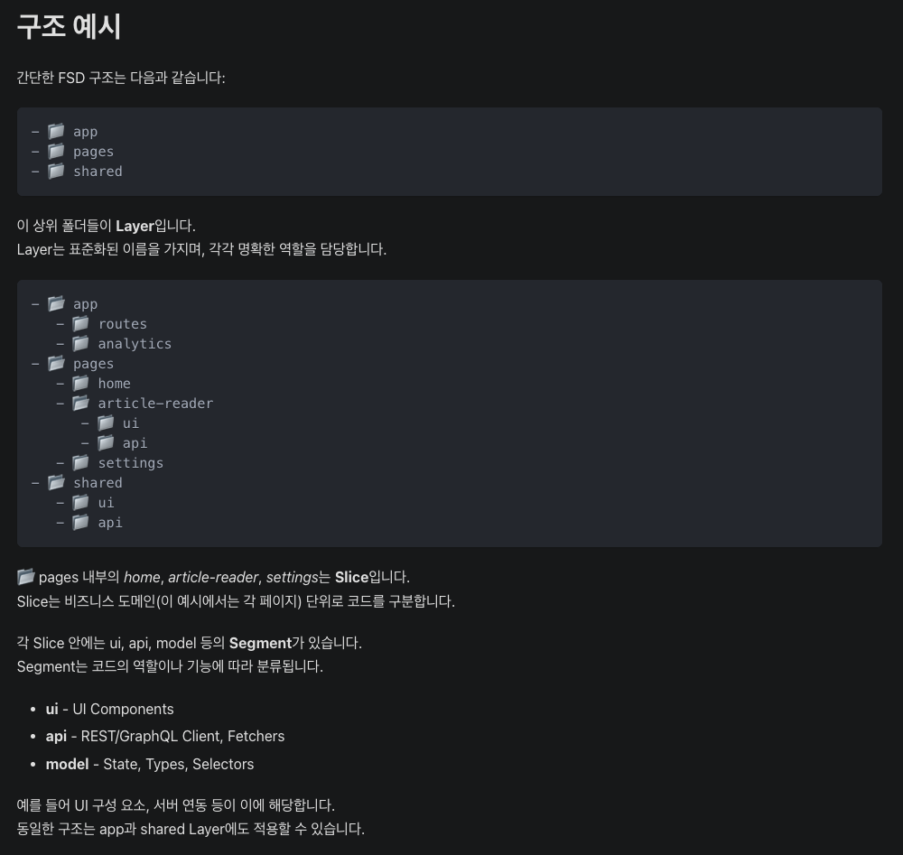
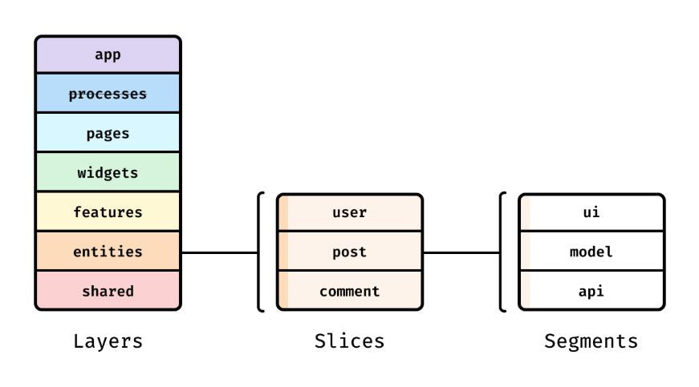

### 설명 문서
https://feature-sliced.design/kr/docs/get-started/overview



### 계층 구조


- **Layers(features) > Slices(domain) > Segments(api, ui, model)**

### 사용 예시

```
features/domain/
 ├─ ui/        # 화면 및 UI 컴포넌트
 ├─ api/       # 서버 통신
 ├─ model/     # 상태, 비즈니스 로직
 ├─ lib/       # 내부 헬퍼
 ├─ config/    # 환경 구성
 ├─ locales/   # 번역 파일
 ├─ assets/    # 정적 파일
 ├─ providers/ # 프로바이더
 ├─ hooks/     # 내부 훅 (선택)
 ├─ styled/    # 스타일드 컴포넌트 (선택)
 └─ index.ts   # Public API

```

### 개발 시 순서

1. 위젯에서 모든 작업을 일정에 맞춰 빨리 진행
2. shared에 공통 분리하고
3. 시간나면 features에 기능 분리하는 식으로 점진적으로 도입
